# 🚀 DevFlow AI

DevFlow AI is a backend-focused platform for technical repository analysis, software quality insights, automated findings generation, historical comparison and executive PDF reporting.

The project was built to demonstrate practical backend engineering skills using FastAPI, PostgreSQL, Docker, JWT authentication, repository scanning, quality metrics, service-oriented architecture and structured technical reports.

DevFlow AI does not only point out problems in a codebase. It analyzes technical quality, explains the score, tracks historical evolution and generates a prioritized improvement roadmap.

---

## 📸 Preview

### Dashboard

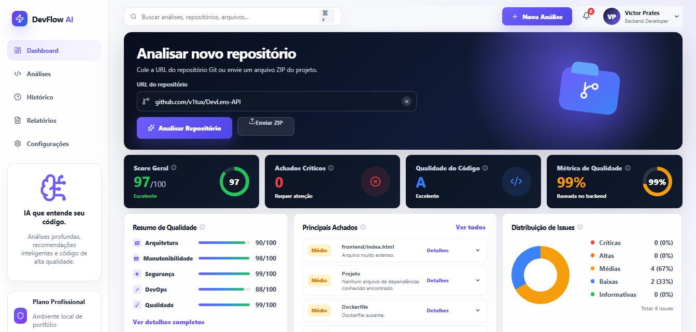

### Quality Metrics

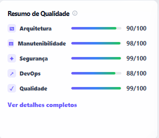

### Technical Findings

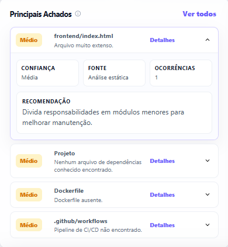

### Analysis Detail Panel

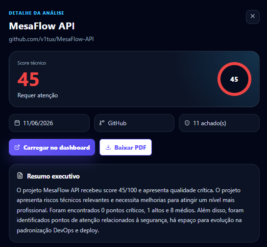

### Analysis Comparison

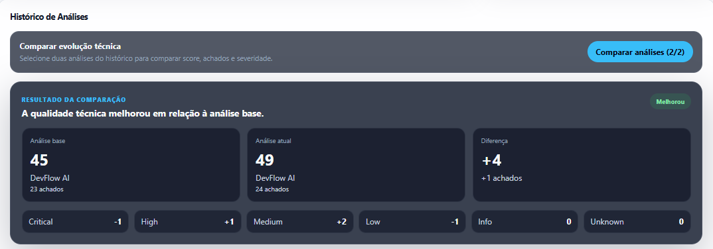

### Improvement Roadmap

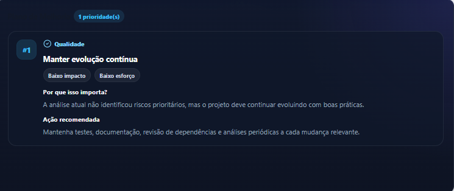

### Executive PDF Report

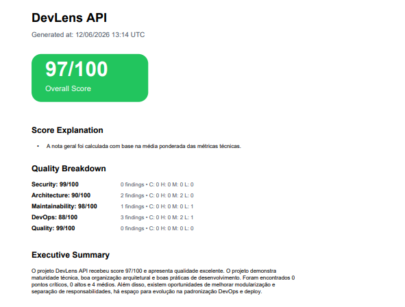

### PDF Improvement Roadmap

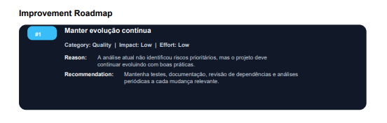

---

## ✨ Features

* 🔐 JWT authentication
* 🛡️ Protected API routes
* 👤 User-scoped analyses
* 🐘 PostgreSQL persistence
* 🐳 Dockerized environment
* ⚡ FastAPI backend
* ⚛️ React + Vite frontend
* 🔍 GitHub repository analysis
* 📦 ZIP upload analysis
* 📊 Backend-driven quality metrics
* 🧠 Score explanation system
* 🧾 Enriched technical findings
* 📌 Finding confidence, evidence and source
* 🗂️ Grouped repeated findings with occurrences
* 🧪 Secret detection with contextual rules
* 🐳 Dockerfile and DevOps checks
* 📈 Historical analysis tracking
* 🔁 Analysis comparison
* 🧭 Prioritized improvement roadmap
* 🧠 AI-assisted technical review
* 🔎 Detailed analysis panel
* 📄 Executive PDF report generation
* 📌 Improvement roadmap inside PDF reports
* ❤️ Healthcheck endpoint
* 📈 Metrics endpoint
* 🧪 CI/CD validation pipeline with Ruff

---

## 🧠 Tech Stack

### Back-End

* Python
* FastAPI
* SQLAlchemy
* PostgreSQL
* Pydantic
* JWT / OAuth2
* ReportLab
* Radon
* Bandit

### Front-End

* React
* Vite
* JavaScript
* Axios
* Lucide React
* Custom CSS

### DevOps / Quality

* Docker
* Docker Compose
* GitHub Actions
* Ruff Lint
* Environment variables

---

## 🏗️ Architecture

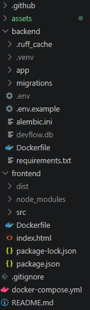

The application follows a service-oriented backend structure:

```txt
Frontend React
   ↓
FastAPI API
   ↓
Auth / Analysis Routes
   ↓
RepositoryService
AnalyzerService
AIService
AIReviewService
ImprovementRoadmapService
ReportService
StackDetectionService
   ↓
PostgreSQL
```

### Main Backend Responsibilities

* `RepositoryService`: clones and cleans temporary GitHub repositories.
* `AnalyzerService`: performs static checks, metrics calculation, findings enrichment and scoring.
* `AIService`: generates technical summaries with fallback behavior.
* `AIReviewService`: enriches the analysis with AI-style technical review insights.
* `ImprovementRoadmapService`: generates prioritized technical improvement actions.
* `ReportService`: builds executive PDF reports.
* `StackDetectionService`: detects technologies used in the analyzed project.

---

## 🔐 Authentication Flow

The API uses JWT-based authentication.

### Flow

1. User creates an account.
2. User logs in.
3. The API generates a JWT token.
4. Protected routes require a Bearer Token.
5. Unauthorized requests return `401 Unauthorized`.

### Protected Routes

* `POST /analyses/repository`
* `POST /analyses/upload`
* `GET /analyses`
* `GET /analyses/{analysis_id}`
* `GET /analyses/compare`
* `GET /analyses/{analysis_id}/report`

---

## 📊 Repository Analysis Flow

The analysis pipeline works as follows:

```txt
GitHub URL or ZIP upload
   ↓
Repository extraction / clone
   ↓
Static checks
   ↓
Security and secret detection
   ↓
Complexity analysis
   ↓
DevOps and Docker checks
   ↓
Quality metrics calculation
   ↓
Score explanation
   ↓
AI-assisted review
   ↓
Improvement roadmap generation
   ↓
Findings grouping and ranking
   ↓
Dashboard + Detail View + PDF Report
```

---

## 📈 Quality Metrics

DevFlow AI calculates quality metrics on the backend and sends them to the frontend as structured data.

Current metric groups:

* Security
* Architecture
* Maintainability
* DevOps
* Quality

Each metric includes:

* Score
* Findings count
* Critical findings
* High findings
* Medium findings
* Low findings

Example:

```json
{
  "security": {
    "score": 53,
    "findings_count": 9,
    "severity": {
      "critical": 0,
      "high": 1,
      "medium": 7,
      "low": 1
    }
  }
}
```

---

## 🧮 Scoring Strategy

The overall score is calculated from weighted technical metrics.

Current scoring weights:

```txt
Security: 35%
Maintainability: 25%
Architecture: 15%
Quality: 15%
DevOps: 10%
```

The score can also be limited by risk rules, such as:

* Critical findings
* High number of high-severity findings
* Security score equal to zero

This prevents the platform from showing an optimistic score when the repository has serious risks.

---

## 🧠 Score Explanation

DevFlow AI explains why a project received a specific score.

Example:

```txt
The score was strongly impacted because the security metric is low.
Several high-severity findings were detected.
Even with acceptable areas, the global project risk is still relevant.
```

This makes the analysis easier to understand and improves transparency.

---

## 🧭 Improvement Roadmap

DevFlow AI generates a prioritized technical improvement roadmap based on score, findings and quality metrics.

Each roadmap item includes:

* Priority
* Title
* Category
* Impact
* Effort
* Technical reason
* Recommended action

Example:

```json
{
  "priority": 1,
  "title": "Reduce high-severity findings",
  "category": "quality",
  "impact": "high",
  "effort": "medium",
  "reason": "High-severity findings can affect reliability, maintainability and safe project evolution.",
  "recommendation": "Group findings by category and fix first the ones that impact security, architecture and the main application flow."
}
```

This allows the platform to answer not only what is wrong, but also what should be improved first.

---

## 🔁 Analysis Comparison

DevFlow AI allows users to compare two previous analyses.

The comparison includes:

* Base analysis score
* Target analysis score
* Score delta
* Findings delta
* Severity delta
* Improvement, regression or stable status

This helps track whether the project quality improved or worsened over time.

---

## 🔎 Analysis Detail Panel

Each historical analysis can be opened in a dedicated detail panel.

The detail view includes:

* Project name
* Repository origin
* Analysis date
* Technical score
* Executive summary
* Metrics breakdown
* Improvement roadmap
* Technical findings
* PDF download action
* Option to load the selected analysis into the dashboard

---

## 📂 Technical Findings

Findings are enriched with structured information:

* Category
* Severity
* Priority
* Confidence
* Evidence
* Source
* Recommendation
* Occurrences
* Impacted files

Example:

```json
{
  "category": "security",
  "severity": "medium",
  "confidence": "medium",
  "source": "sensitive_field_detector",
  "message": "Sensitive field identified in schema/model.",
  "evidence": "A sensitive term was found without clear evidence of a hardcoded secret.",
  "recommendation": "Ensure sensitive fields are validated, protected and never returned in public responses."
}
```

---

## 🛡️ Security Analysis

The analyzer includes contextual security checks to reduce false positives.

It can differentiate between:

```txt
password: str
```

and:

```txt
SECRET_KEY = "hardcoded-value"
```

Examples of security checks:

* Possible hardcoded secrets
* Sensitive fields in schemas/models
* Use of `eval`
* Bandit security scan results
* Environment variable usage
* Docker container running as root

---

## 🐳 DevOps and Docker Analysis

DevFlow AI checks for DevOps maturity signals such as:

* Dockerfile presence
* `.dockerignore`
* `.env.example`
* `docker-compose.yml`
* GitHub Actions workflow
* Dockerfile quality
* Use of `WORKDIR`
* Use of `CMD` or `ENTRYPOINT`
* Use of non-root user
* Avoiding `latest` image tags

---

## 📄 Executive PDF Report

The platform generates a PDF report containing:

* Project name
* Overall score
* Generated date
* Score explanation
* Quality breakdown
* Executive summary
* Improvement roadmap
* Top findings
* Confidence and evidence
* Occurrences
* Impacted files
* Recommendations

The report is designed to provide a technical but readable overview for review, documentation or portfolio presentation.

---

## 📊 API Documentation

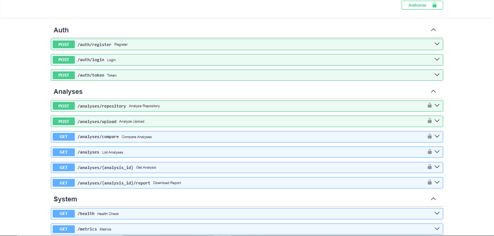

Swagger is available at:

```txt
http://localhost:8000/docs
```

---

## 🐳 Running with Docker

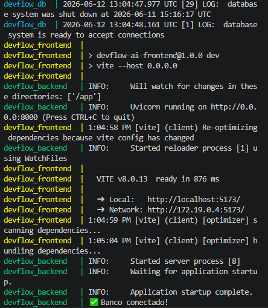

### Start project

```bash
docker compose up --build
```

### Front-End

```txt
http://localhost:5173
```

### Back-End API

```txt
http://localhost:8000
```

### Swagger Docs

```txt
http://localhost:8000/docs
```

---

## ⚙️ Environment Variables

Example `.env`:

```env
APP_NAME=DevFlow AI
APP_ENV=development
SECRET_KEY=your-secret-key
DATABASE_URL=postgresql+psycopg://postgres:postgres@db:5432/devflow
CORS_ORIGINS=http://localhost:5173
```

Recommended additional file:

```txt
.env.example
```

This file should document required environment variables without exposing real secrets.

---

## 🧪 Quality and CI

The project includes automated validation with GitHub Actions.

Current quality checks:

* Backend lint with Ruff
* Docker-based development workflow
* Protected backend routes
* Healthcheck endpoint
* Metrics endpoint

---

## 📁 Project Structure

```txt
devflow-ai/
├── backend/
│   └── app/
│       ├── api/
│       ├── auth/
│       ├── core/
│       ├── models/
│       ├── schemas/
│       ├── services/
│       └── utils/
├── frontend/
│   └── src/
│       ├── components/
│       ├── services/
│       └── styles/
├── assets/
├── docker-compose.yml
└── README.md
```

---

## 📈 Roadmap

### ✅ Completed

* JWT authentication
* PostgreSQL integration
* Docker Compose environment
* Protected routes
* Repository analysis
* ZIP upload analysis
* Backend-driven metrics
* Score explanation
* Findings enrichment
* Grouped repeated findings
* Context-aware secret detection
* DevOps and Docker checks
* Executive PDF report
* Improvement roadmap
* Improvement roadmap inside PDF reports
* Analysis detail panel
* Historical score comparison
* AI-assisted review layer
* Swagger/OpenAPI
* Metrics and healthcheck endpoints
* CI/CD pipeline

### 🚧 Next Steps

* Background queue for long analyses
* Advanced repository size handling
* Team workspaces
* Pull request analysis
* Production deploy
* Advanced PDF layout
* More test coverage
* Repository private access
* Analysis by branch
* Dashboard filters and advanced search
* Public demo environment

---

## 👨‍💻 Author

Victor Anderson Lobo Prates

* GitHub: https://github.com/v1tux
* LinkedIn: https://linkedin.com/in/victor-lobo-prates-196970233

---

## ⭐ About

DevFlow AI is a portfolio project focused on backend engineering, repository analysis, software quality metrics, historical comparison and technical reporting.

The goal is to demonstrate practical experience with API design, authentication, database persistence, Docker, static analysis, scoring systems, PDF generation, service-oriented architecture and modern backend development.
